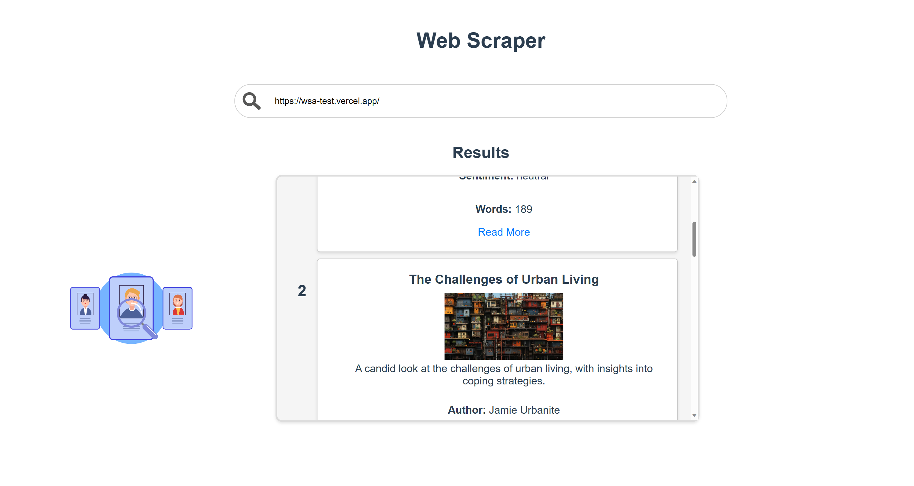

# Web Scrapper API Documentation

This repository provides an API for web scraping and sentiment analysis of web content.

## Endpoints

### Get Scrapped Content

- **URL**: `/scrape`
- **Method**: GET
- **Query Parameters**:
  - `url` (string, required): The URL of the web page to be scraped.
- **Description**: Scrapes web content, performs sentiment analysis, and returns the scrapped data.

#### Example Request

GET /scrape?url=https://example.com

#### Example Response

```json
[
  {
    "title": "Sample Title",
    "short_description": "Short description of the content.",
    "author": "John Doe",
    "profession": "Author",
    "href": "https://example.com/page1",
    "image": "https://example.com/image.jpg",
    "sentiment": "positive",
    "words": 250
  },
  {
    "title": "Sample Title 2",
    "short_description": "Some other short description of the content.",
    "author": "Michael Jordan",
    "profession": "Teacher",
    "href": "https://example.com/page2",
    "image": "https://example.com/image2.jpg",
    "sentiment": "neutral",
    "words": 138
  }
]
```

## Installation

### Clone the Repository

1. Open your terminal or command prompt.

2. Navigate to the directory where you want to clone the project.

3. Run the following command to clone the repository:

   ```bash
   git clone https://github.com/glandaDarie/web-scraper-api.git
   ```

## Backend Setup

1. Navigate to the backend directory:

   ```bash
   cd backend
   ```
   
2. Install the required dependencies:

   ```bash
   npm install
   ```

3. Start the backend server:

   ```bash
   node app.js
   ```

## Frontend Setup

1. Navigate to the frontend directory:

   ```bash
   cd frontend
   ```

2. Install the required dependencies:

   ```bash
   npm install
   ```

3. Start the frontend server:

   ```bash
   npm run serve
   ```

## Usage

With both the backend and frontend servers running, you can access the web scraper application using your web browser.

1. Open your web browser and visit http://localhost:8080 to use the frontend interface.
2. Make API requests to the backend at http://localhost:3000/scrape for web scraping.

## Note

Ensure that both servers are running simultaneously for the full functionality of the application. The frontend provides a user-friendly interface, while the backend handles web scraping and sentiment analysis.

## Images 



